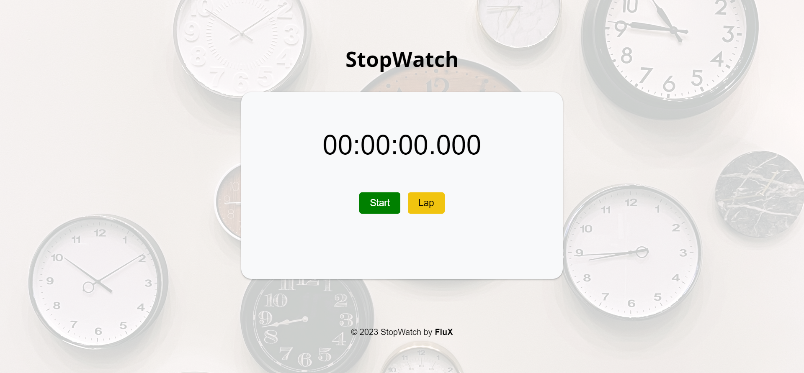

# StopWatch Web Application - PRODIGY_WD_02

Welcome to the **Stopwatch** Web Application repository! This document will help you understand the key features of the project.



## Introduction

A lightweight and user-friendly web-based StopWatch application with features for starting, stopping, continuing, recording laps, and resetting the timer. This minimalistic stopwatch is designed for simplicity and ease of use.

## Table of Contents

- [Live Demo](#demo)
- [Features](#features)
- [Technologies Used](#technologies-used)
- [Getting Started](#getting-started)
- [Usage](#usage)
- [Getting Started](#getting-started)

## Demo

To use the StopWatch App, simply open the [StopWatch](https://dilkhan-1.github.io/PRODIGY_WD_02/).


## Features

- **Start**: Begin the stopwatch timer.
- **Stop**: Pause the timer at any point.
- **Continue**: Resume the stopwatch after stopping.
- **Lap**: Record time intervals and view them.
- **Reset**: Clear the stopwatch and start from zero.
- **User-friendly Interface**: Easily track time with a clean and intuitive interface.
- **Efficient and Swift**: Experience quick performance, ensuring smooth functionality within web browsers.

## Technologies Used

- **HTML**: For structuring the web page.
- **CSS**: For styling and design.
- **JavaScript**: For stopwatch functionality.

## Getting Started

### Prerequisites

- Web browser (Google Chrome, Mozilla Firefox, etc.)
- Code editor (Visual Studio Code, etc.) for further development (optional).

### Installation

1. Clone or Download the repository to your local machine:
```bash
git clone https://github.com/Dilkhan-1/PRODIGY_WD_02.git
```

2. Open the project folder.
```bash
cd PRODIGY_WD_02
```

3. Open the `index.html` file in your web browser to start using the stopwatch.

## Usage

1. Click the "Start" button to begin the stopwatch.
2. Use the "Stop" button to pause the timer when needed.
3. Click "Continue" to resume the stopwatch after stopping.
4. Record time intervals using the "Lap" button, and they will be displayed below the stopwatch.
5. Hit "Reset" to clear the stopwatch and start from zero.

## Contributing

Contributions are welcome! If you have ideas for improvements or new features, feel free to fork the repository and create a pull request. Here are a few ways you can get involved:

1. Fork the repository.
2. Create a new branch for your feature or bug fix.
3. Report bugs or suggest improvements.
4. Make your changes and commit them.
5. Push your changes to your forked repository.
6. Create a pull request with your enhancements and with a clear description of your changes.
